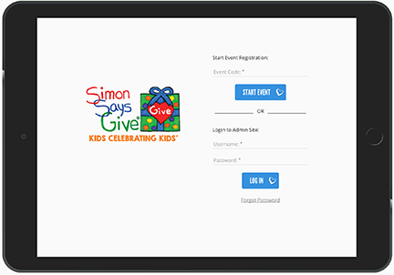
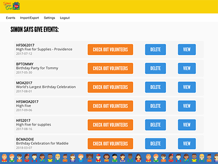
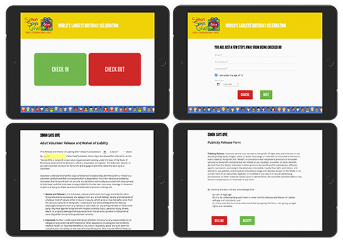

# SIMON SAYS GIVE Volunteer Application
## Prime Digital Academy Full Stack Engineering Program - Group Project

## Table of Contents

- [Description](#description)
- [Product Example](#product-example)
- [Contributors](#contributors)
- [Technologies](#technologies)
- [Exported CSV Format](#exported-csv-format)
- [Local Installation](#local-installation)
- [Acknowledgments](#acknowledgments)

---
## Description

The product facilitates volunteer check in and check out, including signing of waivers.
It allows admins to import existing .csv files, and export the volunteer data for reporting and analysis.

---
## Product Example

### **Landing Page**

This landing page allows for either an admin user to enter username and password, or for a staff member to enter the day's event code to begin the Check In Process.

### **Admin Panel**

The Admin Panel allows admin users to:

- Create new admin users
- Import CSV data
- Export CSV data by date range
- View all events
- Create new events
- Edit events
- Delete events
- Log out volunteers who have forgotten to log themselves out of an event

### **Check In Process**

The Check In Process walks volunteers through:

- Identification by unique combination of email address and name
- Confirmation of adult or minor status
- Waivers appropriate for status:
    - Liability Waiver
    - Photo Release Waiver
- Confirmation of successful check in
- Staff notification if volunteer declines waiver or if minor is unaccompanied by adult

### **Check Out Process**

The Check Out Process:

- Requires either email address, or first name, or last name
- Provides a list of matching active volunteers who can be selected
- Checks out the selected volunteers
- Confirms successful check out

---
## Contributors

- [Craig Baird](https://github.com/craigbaird)
- [Claudia Calderas](https://github.com/claudiacalderas)
- [Christopher Keller](https://github.com/cjameskeller)
- [Erin Kinnen](https://github.com/erinkinnen)
- [Lisa Schoofs](https://github.com/lisaschoofs)

---
## Technologies

### Primary

- [**AngularJS**](https://angularjs.org/)
- [**Angular Material**](https://material.angularjs.org/)
    - [Angular Route](https://www.npmjs.com/package/angular-route)
- [bcrypt](https://www.npmjs.com/package/bcrypt)
- [csvtojson](https://www.npmjs.com/package/csvtojson)
- [**Express**](https://expressjs.com/)
    - [Express Session](https://www.npmjs.com/package/express-session)
- [json2csv](https://www.npmjs.com/package/json2csv)
- [**Node.js**](https://nodejs.org/en/)
- [Passport](http://passportjs.org/)
- [**PostgreSQL**](https://www.npmjs.com/package/pg)

### Build Tools

- [Grunt](https://gruntjs.com/)

### Deployment

- [Heroku](https://www.heroku.com/)

---
## Exported CSV Format

|Column 1|Column 2|Column 3|Column 4|Column 5|Column 6|
|--------|--------|--------|--------|--------|--------|
|value 1 |value 2 |value 3 |value 4 |value 5 |value 6 |

---
## Local Installation

### Requirements

[Git](https://git-scm.com/), which allows the files to be brought down to the computer;
[npm](https://nodejs.org/en/download/), which comes included with Node;
[Postico](https://eggerapps.at/postico/), which acts as a local database.

### Instructions

This project can also be run on a personal computer instead of online.
There are three quick steps described individually below:

- **First**, create a git repository on your computer.
    - Create a new folder for the project.
    - Open a terminal window on Mac by right clicking on the folder and selecting "New Terminal at Folder".
    - In the terminal window, type `git init`, and hit enter.
    - Next, type `git remote add origin ` and add the web address for the Github repository the code is located on, with `.git` added to the end of that web address without a space in between, and hit enter.
    - Finally, type `git pull origin master`, and watch the as the files are brought down to the computer.

- **Second**, install the dependencies.
    - In order for the program to run, some other programs that it needs in order to work have to be installed. This is done in one step by typing `npm install` in the same terminal window and hitting enter. Again, the terminal window will show the files being brought into the project folder.
    - One of the dependencies is called Grunt, and it works by typing `grunt` in the same terminal window.
    - Watch the terminal display as it makes changes, and then type `^c` to turn it off and allow the server to be started.
    - Start the Postico application.
    - Copy the text in the `database.sql` file into the "SQL Query" field, highlight all of it, and hit enter. Postico should indicate success for creating the database needed to run the application.

- **Third**, start the server.
    - In the same terminal window, type `npm start`, and the terminal will display "Listening on port 5000".
    - Type "localhost:5000" in the address bar of your browser, and now the application is running, without a need for internet access! However, this means the application also cannot make changes to the real database, so local installation is only useful for testing.
    - When done using the application locally, type `^c` again to turn the server off.

---
## Acknowledgments

- The entire [Simon Says Give](http://www.simonsaysgive.org) team
- The instructors and staff at [Prime Digital Academy](https://primeacademy.io/)

---
